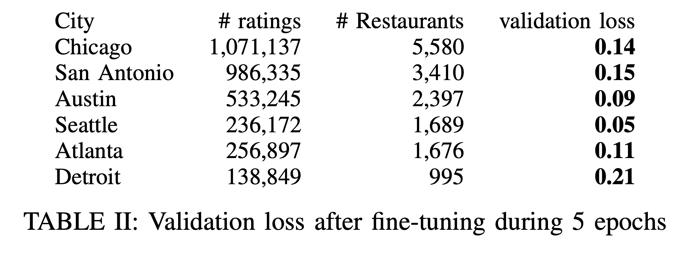

# CS330 Transfer and Meta-Learning in Graph Neural Networks: A Recommender System Approach

## Table of contents
* [General info](#general-info)
* [Technologies](#technologies)
* [Screenshots](#screenshots)
* [Status](#status)
<!--* [Inspiration](#inspiration)
* [Contact](#contact)-->

## General info
Code for our CS 330 Deep Multi-Task and Meta Learning Final Project:
Transfer and Meta-Learning in Graph Neural Networks: A Recommender System Approach

Code is divided into two main folders:

* **Transfer_Learning_and_Joint-Loss** contains the code implementation of a GCN rating-prediction model, and scripts used for fine-tuning and joint-loss training experimentation 
* **Meta-Learning** contains the code base for the MAML and Meta-Graph implementations, the base VGAE link prediction model, and data-processing code 


## Technologies
#### Transfer_Learning_and_Joint-Loss
* python -version 3.8.16
* pytorch -version 1.13.0+cu166
* torch_geometric -version 2.2.0
* sklearn.model_selection
#### Meta-Learning
* pytorch
* torch_geometric.nn
* torch_scatter
* sentence_transformers
* sklearn.metrics
* utils.utils

<!--## Baseline Model
keras implementation (https://github.com/divamgupta/image-segmentation-keras/) -->
## Screenshots


<!-- -->


<!--## Setup-->
<!--Available soon-->
<!--Describe how to install / setup your local environement / add link to demo version.-->

<!--## Code Examples
Show examples of usage:
```
from keras_segmentation.models.unet import unet_mini

model = unet_mini(n_classes=4,  input_height=96, input_width=96  )

model.train(
    train_images = "Dataset/train/",
    train_annotations = "Dataset/train_labels/",
    checkpoints_path = "Dataset/checkpoints",
    val_images = "Dataset/test/",
    val_annotations = "Dataset/test_labels/",
    epochs=50, validate=True, batch_size=8, 
    optimizer_name="adam",
    gen_use_multiprocessing=True,
    auto_resume_checkpoint=False,
    val_batch_size=2,
)
```

## Features
List of features ready and TODOs for future development
* Train on 3 different U-NET architecture variants-->

## Results
#### Transfer_Learning_and_Joint-Loss



#### Meta-Learning


The goal of this project was to explore the effectiveness of several approaches in utilizing restaurant-user patterns of other geographical locations to create a better recommender model with less data. In both the transfer learning and meta-learning approaches we experimented with, we found that these approaches were able to perform noticeably better than the baseline models that do not utilize data from other geographical locations. Given this, it seems the approaches we have tried are effective in creating higher-performing city-specific restaurant recommendation models by utilizing data from other cities.

## Status
Project is: _finished_ <!-- a normal html comment _finished_, _no longer continue_ and why?-->

## Report
CS330 Fall 2022 Paper [link](paper/CS330_Final_Project_Report.pdf)

<!--## Inspiration-->
<!--Add here credits. Project inspired by..., based on...

<!--## Contact-->
<!--Created by [@flynerdpl](https://www.flynerd.pl/) - feel free to contact me!-->
